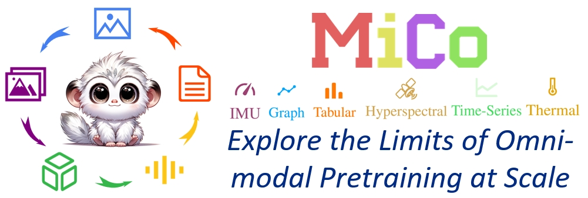
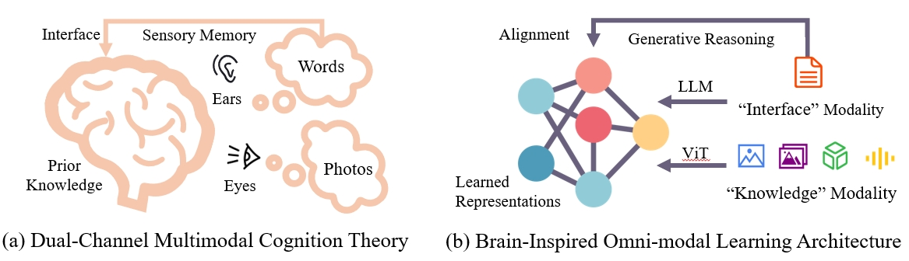
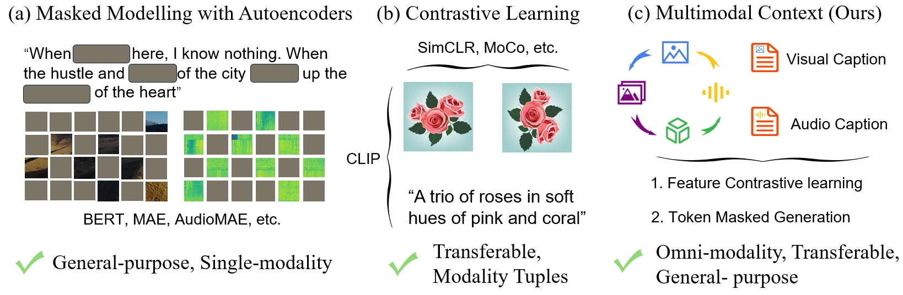
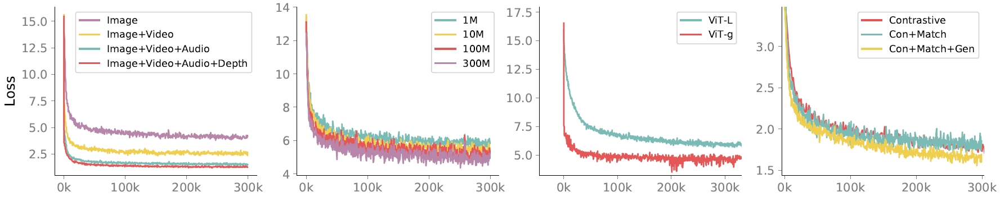

<p align="center" width="100%">

</p>

[](https://arxiv.org/abs/2406.09412)
[](https://invictus717.github.io/MiCo/)
[](https://huggingface.co/Yiyuan/MiCo-ViT-g-14-omnimodal-300k-b64K)
<a href="#LICENSE--citation">
  
</a>
<!-- <a href="https://twitter.com/_akhaliq/status/1682248055637041152"></a>
<a href="https://www.youtube.com/watch?v=V8L8xbsTyls&ab_channel=CSBoard"></a>  -->


### ✨ Inspiration of Multimodal Context: Multimedia Brain Cognition

<p align="center" width="100%">

</p>

***How the human brain performs coherent multimodal cognition?***

As outlined in Richard Mayer's Cognitive Theory of Multimedia Learning,our brain processes multimedia signals through two distinct channels—auditory and visual—in sensory memory, as depicted in Figure(a). The sensory memory integrates these signals with prior knowledge through words, transforming new multimedia information into long-term memory. Notably, **1**) multimedia signals in the brain share channels, and **2**) words function as the reasoning interface in our brain.

Inspired by these insights, we categorize diverse modalities into two types: ``knowledge modality`` and ``interface modality``. *Knowledge modalities*, primarily derived from raw sensors, contribute knowledge in diverse formats. For example, images and depth maps offer visual knowledge, while audio and video provide auditory and spatiotemporal knowledge. The language modality, developed by humans, is inherently more abstract and naturally functions as the *interface modality*, facilitating learning, reasoning, and the coordination of knowledge. To this end, we design an omni-modal learning architecture, illustrated in Figure (b), with two distinct branches: one for knowledge modalities and one for the interface modality, *i.e.* natural language. The knowledge and interface modalities are aligned through a novel generative reasoning method.

### 🚀 MiCo, An omni-modal and scalable pretraining paradigm

<p align="center" width="100%">

</p>

We propose collecting large-scale omni-modal paired data, including text,
image, video, depth, and normal maps, to learn universal representations.

<p align="center" width="100%">

</p>

**🚀 Evolution of Pretraining Paradigms**. Masked modeling (a) has shown great success in single modality, general-purpose understanding. Contrastive learning (b) distinguishes transferable features with modality tuples (such as text-image, text-video, text-audio, etc). 

*🚀🚀🚀 We aim to achieve general-purpose omni-modal understanding and learn transferable, universal representations in (c).*

### 🌟🌟🌟 The Multimodal Scaling Laws with MiCo: Modalities Help Modalies!

<p align="center" width="100%">

</p>

### 🔓 Pretrained Omni-Modal Models
<!-- <details> -->
**We will continue to update this model zoo including all scales of ViTs and highly-efficient ConvNets with the MiCo pretraining paradigm**

<summary> Current Checkpoints </summary>
<br>
<div>

|      Model      |   Pretraining   | Scale |  Modality | #Param |                                               Google Drive | Hugging Face
| :------------: | :----------: | :----------------------: | :----: | :---------------------------------------------------------------------------------------------------: |:----: | :----: | 
| MiCo  | 300k steps |         ViT-g          | Omni-modal |  1.3B  |   [ckpt](https://drive.google.com/drive/folders/1AIQjV1KU8K4OXiO-4gFirxkoxt3twWIq?usp=sharing)    | [ckpt](https://huggingface.co/Yiyuan/MiCo-ViT-g-14-omnimodal-300k-b64K)


</div>

### 🔓 Omni-Modal Dataset Collection

We provdie a detailed [doc](data/README.md) for preparing the omni-modal dataset step-by-step

### ⚡ Quick Start
```bash
pip install gdown 
gdown 1AIQjV1KU8K4OXiO-4gFirxkoxt3twWIq --folder
python inference_demo.py
```
# Citation
If the code and paper help your research, please kindly cite:
```
@article{zhang2024explore,
  title={Explore the Limits of Omni-modal Pretraining at Scale},
  author={Zhang, Yiyuan and Li, Handong and Liu, Jing and Yue, Xiangyu},
  journal={arXiv preprint arXiv:2406.09412},
  year={2024}
}
```
# License
This project is released under the [Apache 2.0 license](LICENSE).
# Acknowledgement
We appreciate [Dr. Xiaohan Ding](https://dingxiaohan.xyz/) for the valuable discussion and suggestions.This code is developed based [Meta-Transformer](https://github.com/invictus717/MetaTransformer), [VAST](https://github.com/TXH-mercury/VAST), [DPT](https://github.com/EPFL-VILAB/omnidata), and [GeoWizard](https://github.com/fuxiao0719/GeoWizard).